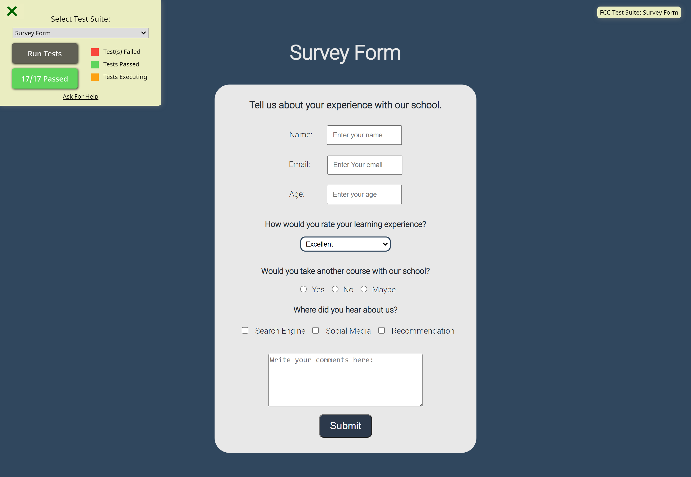

# freeCodeCamp - Learn Responsive Web Design by building a survey-form.

This is a solution to the [freeCodeCamp's Survey-Form project](https://www.freecodecamp.org/).

### Screenshot

### Built with:

- HTML
- CSS

## Author

- freeCodeCamp - [Ruan Esterhuyse](https://www.freecodecamp.org/ruanesterhuyse)
